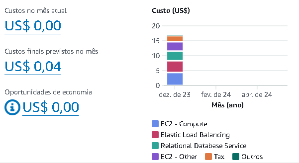

# Relatório de Provisionamento de Arquitetura na AWS


## 1. Objetivo
Provisionar uma arquitetura na AWS utilizando CloudFormation, incluindo um Application Load Balancer (ALB), instâncias EC2 com Auto Scaling e um banco de dados DynamoDB.

## 2. Escolha da Região de Implantação
A região selecionada para a implantação foi **us-east-2 (Ohio)**, devido aos custos relativamente baixos e ao bom desempenho em comparação com outras regiões da AWS.

## 3. Requisitos Técnicos do Projeto

### 3.1 Infraestrutura como Código (IaC) com CloudFormation
- **Utilização do CloudFormation:** Todo o provisionamento de recursos na AWS foi realizado utilizando CloudFormation.
- **Estruturação do Código:** O código YAML está estruturado com comentários explicativos para cada recurso, facilitando a compreensão e manutenção.
- **Automatização Completa:** O script CloudFormation é capaz de criar, atualizar e destruir a infraestrutura completa com um único comando, sem intervenção manual do usuário.

### 3.2 EC2 com Auto Scaling
- **Launch Configuration:** Foi criada uma Launch Configuration com uma AMI que possui a aplicação pré-instalada.
- **Auto Scaling Group (ASG):** Um Auto Scaling Group foi provisionado utilizando a Launch Configuration criada.
- **Políticas de Escalabilidade:** Políticas de escalabilidade foram definidas baseadas em CloudWatch Alarms (por exemplo, utilização da CPU > 70%).
- **Integração com ALB:** Garantida a integração do ASG com o ALB através do Target Group.

### 3.3 Application Load Balancer (ALB)
- **Provisionamento:** Um ALB foi provisionado para distribuir o tráfego entre as instâncias EC2.
- **Target Groups:** Target Groups foram configurados para gerenciar as instâncias EC2.
- **Health Checks:** Health Checks foram implementados para garantir que o tráfego seja direcionado apenas para instâncias saudáveis.

### 3.4 Banco de Dados DynamoDB
- **Provisionamento:** Uma instância DynamoDB foi provisionada para armazenamento de dados.
- **Segurança:** Security Groups foram configurados para garantir que apenas as instâncias EC2 possam se conectar ao banco de dados.

## 4. Detalhamento da Infraestrutura

### 4.1 Instâncias EC2
**Tipo de Instância:** t2.micro  
**Motivo da Escolha:** Escolhida por ser econômica e fornecer recursos suficientes (1 GB de memória e 1 vCPU) para executar a aplicação.

**Zonas de Disponibilidade:** us-east-2a, us-east-2b (Ohio)  
**Motivo da Escolha:** A escolha dessas zonas baseia-se no custo-benefício, sendo uma das opções mais acessíveis em termos de preço.

**Imagem de Máquina:** al2023-ami-2023.4.20240429.0-kernel-6.1-x86_64  
**Motivo da Escolha:** Optou-se por esta imagem gratuita do Amazon Linux por ser a mais econômica e adequada para a instância t2.micro.

### 4.2 Application Load Balancer (ALB)
**Listener:** Porta 80, protocolo HTTP  
**Motivo da Escolha:** A porta 80 e o protocolo HTTP foram escolhidos para processamento de tráfego web de forma padrão e eficiente.

**Target Group:**  
**Motivo da Escolha:** O Target Group foi configurado para agrupar instâncias EC2, garantindo que apenas instâncias íntegras recebam tráfego, utilizando verificações de integridade com intervalos regulares.

**Security Group:** ALBSecurityGroup  
**Motivo da Escolha:** As regras de segurança foram configuradas para permitir tráfego na porta 80 dentro da VPC, garantindo que o tráfego permaneça seguro e dentro da rede.

### 4.3 Auto Scaling Group (ASG)
**Launch Configuration:**  
**Motivo da Escolha:** Define-se a configuração das instâncias com um script de inicialização que clona o repositório da aplicação e a executa, proporcionando uma implantação automática e eficiente.

**Auto Scaling Group:**  
**Motivo da Escolha:** O ASG gerencia as instâncias em um grupo lógico para escalabilidade automática, garantindo que o número de instâncias varie conforme a necessidade, com um mínimo de 2 e máximo de 7 instâncias.

**Scaling Policies:**  
**Motivo da Escolha:** As políticas de escalabilidade foram baseadas na utilização da CPU. Ao atingir 70% de utilização, novas instâncias são adicionadas, monitoradas por um CloudWatch Alarm configurado para verificar a CPU a cada minuto em intervalos de 5 períodos.

### 4.4 Banco de Dados DynamoDB
**DynamoDB Table:**  
**Motivo da Escolha:** A tabela foi configurada com uma chave primária `id` e capacidades de leitura/escrita de 5 unidades por segundo, para um balanceamento eficiente entre desempenho e custo.

**IAM Role:**  
**Motivo da Escolha:** As instâncias EC2 recebem permissões através de IAM Roles, permitindo operações seguras no DynamoDB como GET, PUT, DELETE, UPDATE e SCAN.

**Instance Profile:**  
**Motivo da Escolha:** Anexa a IAM Role às instâncias EC2, assegurando que as permissões necessárias estejam disponíveis.

**VPC EndPoint:**  
**Motivo da Escolha:** Conecta a VPC ao serviço DynamoDB, com rotas públicas direcionando o tráfego ao VPC Endpoint e ao Internet Gateway, garantindo uma conexão eficiente e segura.

## 5. Análise de Custos



## 6. Conclusão
Este relatório detalha a implementação de uma arquitetura na AWS utilizando CloudFormation. A infraestrutura provisionada é robusta e escalável, com componentes chave como ALB, EC2 com Auto Scaling, e DynamoDB. As decisões técnicas foram tomadas com base em custo, que embora, pela analise possamos ver que é bem baixo e no momento não é algo preocupante, as experencias com AWS, mostram que isso um dia vai vir a ser um problema, e desempenho, buscando otimizar os recursos utilizados.

## 7. Execução 
para executar o codigo, primeiro é necessario ter o AWS CLI instaldo na sua maquina.

Com ele instlado, execute o comando para gerar suas keyPairs: 
### Comando de Terminal

```sh
aws ec2 create-key-pair --key-name <NomeDaSuaChave> --query 'KeyMaterial' --output text > <NomeDaSuaChave>.pem
```

em seguida, execute: 
```sh
aws cloudformation create-stack --stack-name my-stack --template-body file://projeto/projeto.yaml --parameters ParameterKey=KeyName,ParameterValue=<Nome da chave Criada> --capabilities CAPABILITY_IAM
```


**Link do repositório:** ((https://github.com/Gustavoms7/Projeto_cloud.git))


